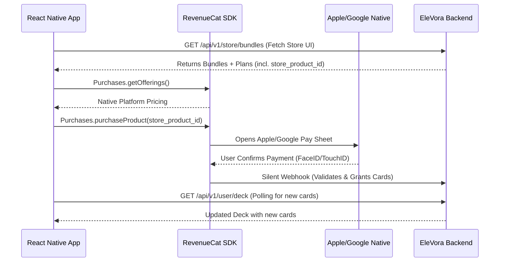

# 🚀 ELEVORA PHASE 4: THE ULTIMATE FRONTEND INTEGRATION GUIDE
**Version:** 1.0.0 (Enterprise-Grade React Native Integration)
**Scope:** Store, RevenueCat IAP, Card Deck, and Room Card Play

---

## 📖 TABLE OF CONTENTS
1. [System Architecture Overview](#1-system-architecture-overview)
2. [RevenueCat React Native Setup](#2-revenuecat-react-native-setup)
3. [The Store Screen Integration](#3-the-store-screen-integration)
4. [The Purchase Flow (Apple Pay / Google Pay)](#4-the-purchase-flow)
5. [The Deck Screen Integration](#5-the-deck-screen-integration)
6. [Playing Cards in a Room](#6-playing-cards-in-a-room)
7. [Advanced Error Handling & Polling](#7-advanced-error-handling--polling)
8. [Premium UI/UX Design Guidelines](#8-premium-uiux-design-guidelines)
9. [Complete API Reference](#9-complete-api-reference)

---

## 1. SYSTEM ARCHITECTURE OVERVIEW

### How the Ecosystem Works
As a frontend developer, you do not need to worry about the backend 80/20 card distribution algorithm or the database triggers. Your job is purely presentation, native billing triggers, and API consumption.

**The Golden Rule of IAP (In-App Purchases):**
*The Frontend triggers the payment. RevenueCat validates the payment. The Backend delivers the digital goods.*



---

## 2. REVENUECAT REACT NATIVE SETUP

### 2.1. Installation
Install the official RevenueCat SDK for React Native.
```bash
npm install react-native-purchases
cd ios && pod install
```

### 2.2. Initialization (App.js or Root Provider)
Initialize the SDK as early as possible in your app lifecycle. Tie the RevenueCat user ID to the EleVora `userId`.

```javascript
import Purchases, { LogLevel } from 'react-native-purchases';
import { Platform } from 'react-native';

const REVENUECAT_API_KEY_IOS = "appl_your_ios_key_here";
const REVENUECAT_API_KEY_ANDROID = "goog_your_android_key_here";

export const initializeRevenueCat = async (elevoraUserId) => {
  try {
    Purchases.setLogLevel(LogLevel.DEBUG); // Helpful for dev
    
    if (Platform.OS === 'ios') {
      Purchases.configure({ apiKey: REVENUECAT_API_KEY_IOS, appUserID: elevoraUserId });
    } else if (Platform.OS === 'android') {
      Purchases.configure({ apiKey: REVENUECAT_API_KEY_ANDROID, appUserID: elevoraUserId });
    }
  } catch (error) {
    console.error("Failed to initialize RevenueCat:", error);
  }
};
```

---

## 3. THE STORE SCREEN INTEGRATION

The Store screen dynamically fetches bundles created by the admin. 

### 3.1. Fetching Bundles
**Endpoint:** `GET /api/v1/store/bundles`
**Headers:** `Authorization: Bearer <user_jwt>`

```javascript
// React Query Example
const { data: storeData, isLoading } = useQuery('storeBundles', async () => {
  const res = await axios.get('/store/bundles');
  return res.data.data.bundles; // Array of bundles
});
```

### 3.2. Fetching Specific Bundle Details
When a user clicks a bundle, fetch the detailed pricing plans.
**Endpoint:** `GET /api/v1/store/bundles/:bundleId`

**Payload Example:**
```json
{
  "id": "abc-123",
  "name": "Romantic Pack",
  "cover_image_url": "https://...",
  "total_cards": 50,
  "plans": [
    {
      "id": "plan-1",
      "name": "Starter",
      "price": 10.00,
      "card_count": 5,
      "store_product_id": "elevora.romantic_pack.starter"
    }
  ]
}
```

---

## 4. THE PURCHASE FLOW

When the user clicks "Buy for ₹10" on the `Starter` plan, you use the `store_product_id` returned by the backend to trigger RevenueCat.

### 4.1. Triggering the Native Payment Sheet

```javascript
import Purchases from 'react-native-purchases';

const handlePurchase = async (plan) => {
  try {
    setLoading(true);
    
    // 1. Trigger Apple Pay / Google Pay
    const { customerInfo } = await Purchases.purchaseProduct(plan.store_product_id);
    
    // 2. If we reach here, Apple/Google successfully charged the user.
    // 3. Now, we must wait for the EleVora backend to receive the webhook
    //    from RevenueCat and allocate the cards.
    
    await pollForNewCards(); // See Section 7 for polling logic
    
    showSuccessToast("Purchase successful! Cards added to your deck.");
    navigation.navigate("MyDeck");

  } catch (e) {
    if (!e.userCancelled) {
      showErrorToast("Payment failed: " + e.message);
    }
  } finally {
    setLoading(false);
  }
};
```

---

## 5. THE DECK SCREEN INTEGRATION

The User Deck screen shows all cards a user owns. Played cards should be greyed out.

### 5.1. Fetching the Deck
**Endpoint:** `GET /api/v1/user/deck`
Returns an array of cards.

**Key Flags to Watch:**
- `is_used` (Boolean): If true, the user has played this card. **UI Rule:** Apply a CSS grayscale filter or 50% opacity.
- `expired` (Boolean): If true, the room session ended. (Note: Currently the backend hides expired cards via `is_visible=false`, but if they appear, treat them as fully locked).

```javascript
const DeckScreen = () => {
  const { data: deck } = useQuery('userDeck', fetchUserDeck);

  return (
    <ScrollView>
      {deck.map(card => (
        <CardComponent 
           key={card.deck_card_id}
           data={card}
           isGreyedOut={card.is_used} 
        />
      ))}
    </ScrollView>
  );
};
```

---

## 6. PLAYING CARDS IN A ROOM

When a user is inside a Live Room, they tap a "Play Card" button. This should open a bottom sheet showing *only available cards*.

### 6.1. Fetching Available Cards
**Endpoint:** `GET /api/v1/user/deck/available`
*(This endpoint strictly returns cards where `is_used = false` and `expired = false`)*

### 6.2. Playing the Card
When the user selects a card from the bottom sheet, you must tell the backend to mark it as used and link it to the room.

**Endpoint:** `POST /api/v1/user/deck/:deckCardId/use`
**Body:** `{ "room_id": "current-room-uuid" }`

```javascript
const playCard = async (deckCardId, roomId) => {
  try {
    // 1. Tell backend to mark it as used
    await axios.post(`/user/deck/${deckCardId}/use`, { room_id: roomId });
    
    // 2. Emit Socket.io event so the partner sees the card appear instantly!
    socket.emit('card_played', { deckCardId, roomId });
    
    // 3. Update local UI state (remove from available list)
    removeCardFromAvailableList(deckCardId);
    
  } catch (error) {
    showErrorToast("Failed to play card. It may have expired.");
  }
};
```

---

## 7. ADVANCED ERROR HANDLING & POLLING

### The "Webhook Race Condition"
When `Purchases.purchaseProduct()` finishes, Apple has taken the money. However, RevenueCat takes 1-3 seconds to send the webhook to our backend, and our backend takes 100ms to run the 80/20 algorithm. 

If the frontend instantly fetches `/user/deck`, the new cards might not be there yet!

**The Solution: Short Polling**
Implement a polling mechanism that checks the deck size until it grows, or times out after 10 seconds.

```javascript
const pollForNewCards = async (originalDeckSize) => {
  let attempts = 0;
  
  return new Promise((resolve, reject) => {
    const interval = setInterval(async () => {
      attempts++;
      const res = await axios.get('/user/deck');
      const newSize = res.data.data.total;
      
      if (newSize > originalDeckSize) {
        clearInterval(interval);
        resolve(); // Cards have arrived!
      } else if (attempts >= 10) {
        clearInterval(interval);
        reject(new Error("Timeout waiting for cards. Pull to refresh in a moment."));
      }
    }, 1500); // Poll every 1.5 seconds
  });
};
```

---

## 8. PREMIUM UI/UX DESIGN GUIDELINES

The client requested a "WOW" factor. Implementing generic lists will result in failure. Follow these strict UI principles for the Store and Deck:

### 8.1. Glassmorphism & Depth
*   Do not use flat solid backgrounds for cards. Use slight transparency, blurs (`blurView` in React Native), and gradients.
*   **Shadows:** Use colored shadows matching the card's theme color (e.g., a Fire card gets a soft red shadow, not a black shadow).

### 8.2. Micro-Animations (Using Reanimated 3)
*   **Card Unboxing:** When new cards arrive after a purchase, do not just make them appear. Implement a "pack opening" animation using React Native Reanimated. Make the cards flip, scale up (`withSpring`), and settle into the grid.
*   **Playing a Card:** When a user taps a card in the room, it should animate upwards and slide into the "Played" area of the screen.

### 8.3. Haptic Feedback
*   Use `react-native-haptic-feedback`.
*   Trigger a `selection` haptic when tapping a bundle plan.
*   Trigger a `notificationSuccess` haptic the exact moment the webhook polling succeeds and the cards appear.
*   Trigger an `impactHeavy` haptic when playing a powerful card in a room.

---

## 9. COMPLETE API REFERENCE

### Store APIs
*   `GET /api/v1/store/bundles`
    *   *Returns list of active bundles with card counts.*
*   `GET /api/v1/store/bundles/:id`
    *   *Returns single bundle with pricing plans.*

### Purchase APIs
*   `GET /api/v1/store/purchase/history`
    *   *Returns a financial ledger of everything the user has bought. Good for a "Settings -> Purchase History" screen.*

### Deck APIs
*   `GET /api/v1/user/deck`
    *   *Returns ALL visible cards. Use this for the main Deck screen.*
*   `GET /api/v1/user/deck/available`
    *   *Returns ONLY unused cards. Use this inside the Room.*
*   `POST /api/v1/user/deck/:deckCardId/use`
    *   *Marks a card as used in the database.*

---
**End of Integration Guide.** 
*Authored by Antigravity AI Architecture Team. Designed for extreme stability and premium user experience.*
